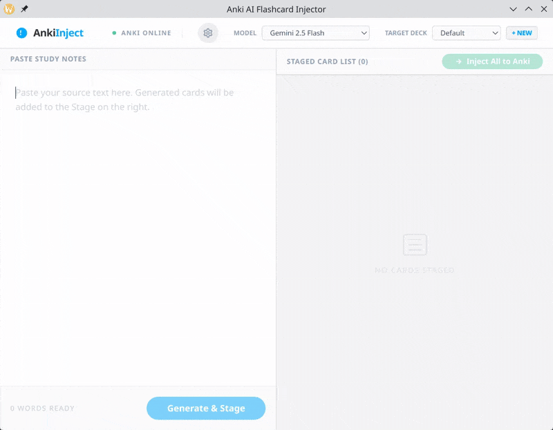

<p align="center">
  
</p>

# 🧠 Anki Inject: AI-Powered Flashcard Creator

[](https://github.com/yourusername/anki_inject/releases)
[](https://opensource.org/licenses/MIT)
[](https://github.com/yourusername/anki_inject/actions)

**Anki Inject** is a minimalist desktop companion designed to streamline your study workflow. Instead of manual data entry, use **Google Gemini AI** as your high-speed formatting assistant to transform "fuzzy" study notes, raw textbook snippets, or unstructured thoughts into perfectly structured Anki flashcards.

> Stop wrestling with formatting. Start refining your knowledge with an AI study collaborator.



---

## ✨ Features

- **🚀 Fuzzy Note Processing**: Paste messy, unstructured notes and let Gemini AI extract core concepts and structure them into clear Q&A pairs.
- **🪄 Formatting Assistant**: Automatically converts raw text into clean HTML-formatted flashcards, saving you hours of manual tagging and styling.
- **👩‍💻 Human-in-the-Loop**: Anki Inject doesn't replace your study process—it accelerates it. Review, refine, and edit every card in an immersive editor before it reaches your deck.
- **🤖 AI Refinement Assistant**: Use natural language to instantly "Simplify", "Explain", or "Correct" any card during the review phase.
- **📥 Seamless Injection**: Directly push your final, polished cards to Anki with a single click.
- **⚙️ Native Persistence**: Securely stores your settings in standard system configuration paths for a truly native experience.
- **🎨 Modern UI**: Features a beautiful, distraction-free interface with stacked card aesthetics and neutral color palettes designed for focus.
- **🔧 Customizable AI Prompts**: Take full control of the generation process. Define your own system prompts in Settings to tailor how the AI formats your cards (e.g., "Always use bold for keywords", "Make it a multiple choice question").

---

## 🛠️ How it Works

1. **Paste your content**: Textbooks, articles, or notes—any text works.
2. **Generate**: Let Gemini AI extract the important bits and structure them as Q&A.
3. **Refine**: Edit cards manually or ask the AI Assistant for help.
4. **Inject**: Send everything to Anki with a single click.

---

## 📥 Installation

### Download Binaries
The easiest way to get started is to download the latest version for your operating system from the [Releases](https://github.com/yourusername/anki_inject/releases) page.
- **Windows**: Download the `.exe` and run.
- **Linux**: Download the `.AppImage`, make it executable (`chmod +x ...`), and run.

### Prerequisites (for Anki Integration)
1. Have [Anki](https://apps.ankiweb.net/) installed and running.
2. Install the [AnkiConnect](https://ankiweb.net/shared/info/2055079234) add-on.

---

## 🏗️ Development Setup

If you want to build from source or contribute:

1. **Clone the repo**:
   ```bash
   git clone https://github.com/yourusername/anki_inject.git
   cd anki_inject
   ```

2. **Backend Setup (Python & uv)**:
   ```bash
   uv sync
   ```

3. **Frontend Setup (Svelte & Node)**:
   ```bash
   cd frontend
   npm install
   npm run build
   cd ..
   ```

4. **Run**:
   ```bash
   uv run main.py
   ```

---

## 🤝 Contributing

Contributions are welcome! Whether it's a bug report, a new feature, or UI polish, feel free to open an issue or pull request.

## 📄 License

This project is licensed under the **MIT License**. See the [LICENSE](LICENSE) file for details.

---

*Powered by Google Gemini AI & Svelte*
*Targeted at Language Learners, and Life-long Students.*
